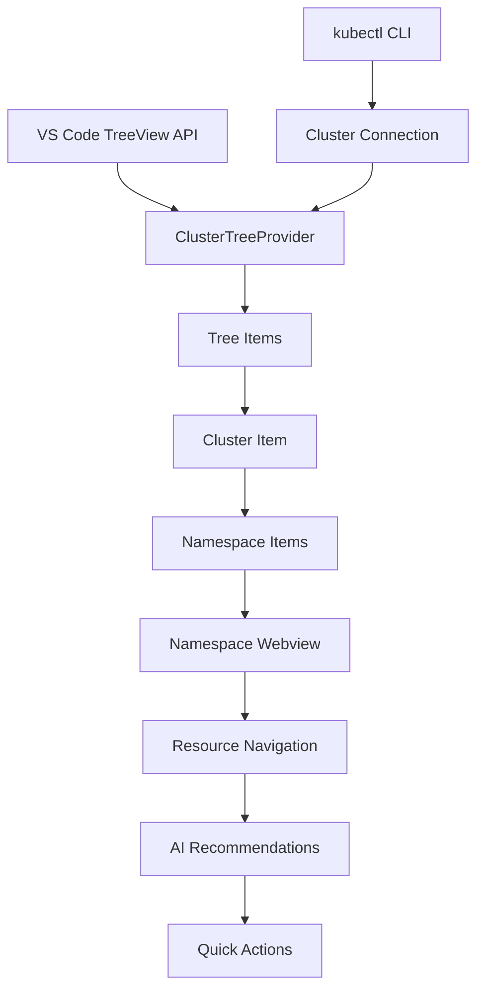
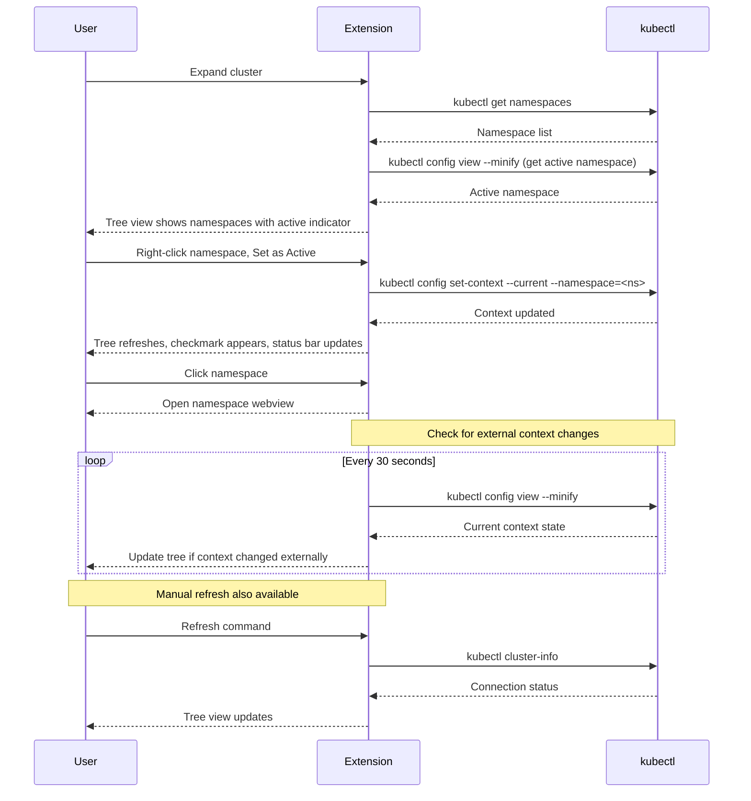

# Tree View Specification

## Overview

The tree view provides simplified navigation of Kubernetes clusters and namespaces. It displays a hierarchical structure: clusters at the top level, with resource categories listed underneath when expanded. The tree view displays a Dashboard menu item as the first item under each cluster, and conditionally displays a Reports menu when the kube9-operator is installed and functioning. Clicking on namespaces opens a webview for detailed resource navigation and management.

## Architecture



## Component Responsibilities

### ClusterTreeProvider
- **Purpose**: Main tree data provider implementing `vscode.TreeDataProvider`
- **Responsibilities**:
  - Parse kubeconfig files and extract cluster information
  - Use kubectl commands to verify cluster connectivity
  - Query namespaces using kubectl
  - Check operator status for each cluster
  - Build hierarchical tree structure (Clusters → Dashboard → Categories → Resources)
  - Display Dashboard menu item as first item under each cluster
  - Conditionally display Reports category based on operator status
  - Manage tree item icons and status indicators
  - Open webviews when namespaces, dashboard, or reports are clicked

### Tree Items Hierarchy

#### Category Level (under clusters)
1. **Dashboard**: Always visible as the first item under each cluster
   - Position: First item (before Reports and all other categories)
   - Visibility: Always visible regardless of operator status
   - Behavior: Clicking opens a dashboard webview
   - Dashboard content varies based on operator status (Free Non-Operated vs Free Operated)

2. **Reports Category** (conditional): Appears only when cluster operator status is NOT 'basic'
   - Position: Second item (after Dashboard, before Nodes)
   - Visibility: Only when `operatorStatus !== OperatorStatusMode.Basic`
   - Structure: Reports → Compliance → Data Collection
   - Reports subcategory: Compliance
     - Compliance report item: Data Collection (placeholder, non-functional)

3. **Resource Categories**: Always visible when cluster is expanded
   - Nodes
   - Namespaces
   - Workloads
   - Storage
   - Networking
   - Helm
   - Configuration
   - Custom Resources

#### Resource Level (under categories)
- **Namespace Items**: Child nodes under Namespaces category
  - "All Namespaces" appears as the first option under Namespaces category
  - Individual namespaces follow alphabetically
  - Clicking any namespace opens a webview for navigation
  - Active namespace shows checkmark icon indicator
  - Right-click context menu provides namespace selection options

## Data Flow



## Implementation Details

### Tree Item Structure
```typescript
interface TreeItemData {
  type: 'cluster' | 'dashboard' | 'namespace' | 'allNamespaces' | 'reports' | 'compliance' | 'dataCollection' | 'resource';
  name: string;
  status?: 'connected' | 'disconnected';
  isActiveNamespace?: boolean; // True if this namespace is set in kubectl context
  operatorStatus?: OperatorStatusMode; // Only relevant for cluster items
  metadata?: {
    context: string;
    cluster: string;
  };
  // For resource items
  resourceType?: string;       // e.g., "Deployment", "Pod", "Service"
  resourceNamespace?: string;  // Namespace containing the resource
  resourceApiVersion?: string; // e.g., "apps/v1"
}
```

### Reports Category Conditional Display

#### Display Logic
- **Condition**: Reports category appears when `clusterElement.operatorStatus !== OperatorStatusMode.Basic`
- **Operator Status Modes**:
  - `Basic`: No operator installed → Reports NOT shown
  - `Operated`: Operator installed, no API key → Reports shown
  - `Enabled`: Operator installed with valid API key → Reports shown
  - `Degraded`: Operator installed but has issues → Reports shown

#### Reports Menu Structure
```
Reports (category)
  └── Compliance (subcategory)
      └── Data Collection (report item - placeholder)
```

#### Implementation Details
- Reports category is prepended to the category list when operator status is not Basic
- Reports category follows the same expandable pattern as other categories
- Compliance subcategory follows the same pattern as other subcategories (e.g., Workloads → Deployments)
- Data Collection report item is a placeholder with no functionality
- Clicking Data Collection should display a placeholder message indicating future functionality

### Networking Category Structure

#### Display Logic
- **Position**: Networking category appears after Storage and before Helm in the category list
- **Visibility**: Always visible when cluster is expanded
- **Purpose**: Groups networking-related Kubernetes resources

#### Networking Menu Structure
```
Networking (category)
  └── Services (subcategory)
      └── Individual service items (namespace/name format)
```

#### Implementation Details
- Networking category follows the same expandable pattern as other categories (e.g., Configuration, Storage)
- Services subcategory follows the same pattern as other subcategories (e.g., Configuration → ConfigMaps)
- Services are displayed in "namespace/name" format for clarity
- Service type (ClusterIP, NodePort, LoadBalancer, ExternalName) is shown in the description
- Each service item displays a network icon (globe or link ThemeIcon)
- Services support all standard context menu actions (View YAML, Edit, Delete, Describe, Copy Name, Copy YAML)
- Double-clicking a service opens the YAML editor
- Tooltips show comprehensive service information (Cluster IP, External IP, Ports, Selectors, Endpoints count)
- Future: Ingress resources will be added as another subcategory under Networking

### Namespace Listing
- Namespaces are queried using `kubectl get namespaces --output=json`
- "All Namespaces" is a special tree item that appears first
- Individual namespaces are sorted alphabetically
- Clicking any namespace item triggers a webview to open

### Namespace Selection via kubectl Context

#### Reading Active Namespace
- Extension reads current namespace from kubectl context on startup
- Command: `kubectl config view --minify --output=jsonpath='{..namespace}'`
- Empty result means no namespace is set (cluster-wide view)
- Cache result for 5 seconds to minimize kubectl calls
- Poll for external changes every 30 seconds

#### Setting Active Namespace
- User right-clicks namespace in tree view
- Selects "Set as Active Namespace" from context menu
- Extension executes: `kubectl config set-context --current --namespace=<namespace-name>`
- Tree view refreshes to show checkmark on active namespace
- Status bar updates to show: "Namespace: <namespace-name>"

#### Clearing Active Namespace
- User right-clicks active namespace or uses command palette
- Selects "Clear Active Namespace" from context menu
- Extension executes: `kubectl config set-context --current --namespace=''`
- Checkmark indicator removed from tree view
- Status bar updates to show: "Namespace: All"

#### Visual Indicators
- **Active Namespace**: Shows checkmark icon (✓) next to namespace name
- **Inactive Namespaces**: No special indicator
- **Status Bar**: Displays current namespace name or "All" if none set
- **Icon Theme**: Use VS Code's built-in "check" icon for active indicator

### Status Indicators
- **Cluster Status**: Connected/disconnected indicators based on kubectl connectivity
- **Connection Method**: Uses `kubectl cluster-info` to verify cluster accessibility
- **Manual Refresh**: User can trigger refresh via command or refresh button
- **Status Persistence**: Cluster status is cached between refreshes to prevent spinner flicker
- **Warning Icons**: Disconnected clusters show a warning triangle icon (exclamation point in triangle)
- **Spinner Behavior**: Spinner only shows during initial connection check or when status is truly unknown

## User Experience

### Visual Design
- **Icons**: Use VS Code's built-in Kubernetes icons where available
- **Colors**: Status-based coloring (green=healthy, yellow=warning, red=error)
- **Badges**: Show resource counts and status summaries
- **Tooltips**: Display additional information on hover

### Interactions
- **Click cluster**: Expand to show Dashboard, Reports (if operator installed), and other resource categories
- **Click Dashboard**: Open dashboard webview (Free Non-Operated or Free Operated based on operator status)
- **Click Reports category**: Expand to show Compliance subcategory
- **Click Compliance subcategory**: Expand to show Data Collection report
- **Click Data Collection**: Display placeholder message (non-functional)
- **Click namespace**: Open webview panel for namespace navigation
- **Click "All Namespaces"**: Open webview showing cluster-wide resource view
- **Click resource**: Context-dependent action (may expand or open details)
- **Right-click namespace**: Context menu with namespace selection actions
- **Right-click resource**: Context menu with "View YAML" and resource-specific actions
- **Manual Refresh**: User-triggered refresh command updates tree and operator status

### Context Menu Actions

#### For Namespace Items (not active)
- **Set as Active Namespace**: Sets this namespace in kubectl context
- **Open in Webview**: Opens webview for this namespace
- **Refresh**: Refreshes this namespace's data

#### For Active Namespace Item
- **Clear Active Namespace**: Removes namespace from kubectl context
- **Open in Webview**: Opens webview for this namespace
- **Refresh**: Refreshes this namespace's data

#### For Resource Items (Deployments, Pods, Services, etc.)
- **View YAML**: Opens YAML editor for the resource in a new tab
- **Edit**: Opens YAML editor in edit mode for the resource
- **Delete**: Deletes the resource from the cluster (with confirmation)
- **Describe**: Shows detailed resource information
- **Copy Name**: Copies resource name to clipboard
- **Copy YAML**: Copies resource YAML to clipboard
- **Refresh**: Refreshes this resource's data

#### Context Menu Registration
```typescript
// In package.json
"menus": {
  "view/item/context": [
    {
      "command": "kube9.setActiveNamespace",
      "when": "view == kube9TreeView && viewItem == namespace && !isActiveNamespace",
      "group": "namespace@1"
    },
    {
      "command": "kube9.clearActiveNamespace",
      "when": "view == kube9TreeView && viewItem == namespace && isActiveNamespace",
      "group": "namespace@1"
    },
    {
      "command": "kube9.viewResourceYAML",
      "when": "view == kube9TreeView && viewItem =~ /^resource/",
      "group": "kube9@1"
    },
    {
      "command": "kube9.deleteResource",
      "when": "view == kube9TreeView && viewItem =~ /^resource/",
      "group": "kube9@2"
    }
  ]
}
```

## Performance Considerations

### Efficient Loading
- **Lazy Loading**: Namespaces loaded only when cluster is expanded
- **Caching**: Cache namespace lists to avoid redundant kubectl calls
- **Simple Structure**: 2-level tree minimizes memory overhead

### Memory Management
- **Minimal Tree Data**: Only clusters and namespaces in tree
- **kubectl Process Management**: Spawn kubectl processes only when needed
- **Status Caching**: Cluster connectivity status cached in memory to reduce redundant checks
- **Context State Caching**: kubectl context state cached for 5 seconds to minimize config file reads
- **External Change Detection**: Poll kubectl context every 30 seconds for external changes

## Error Handling

### Connection Issues
- **Failed kubectl Connection**: Show disconnected status with warning icon immediately
- **Manual Refresh Available**: User can trigger refresh via command or refresh button
- **Clear Error Messages**: Display helpful error message when kubectl fails
- **Graceful Exit**: If kubectl unavailable, show appropriate message without crashing
- **Status Recovery**: Updates icon when connection is restored on manual refresh

### Namespace Access
- **Permission Errors**: Show error in tree if namespaces cannot be listed
- **kubectl Errors**: Display kubectl error messages to user
- **Fallback Display**: Show "Unable to list namespaces" if kubectl fails

### Namespace Context Errors
- **Context Read Failure**: Use cached state if kubectl config read fails, show warning
- **Context Write Failure**: Rollback UI state if kubectl config write fails, show error message
- **Invalid Namespace**: Warn user if selected namespace doesn't exist, suggest clearing selection
- **Permission Denied**: Show error if user lacks permission to modify kubeconfig
- **External Conflicts**: Detect and notify if context changed externally during operation

### Resource Deletion Errors
- **RBAC Permission Denied**: Display user-friendly message "Permission denied: You don't have permission to delete this {resourceType}"
- **Resource Not Found**: Show info message "Resource not found: {resourceType} {name} may have been deleted already", trigger tree refresh
- **Finalizer Blocking**: Display error "Deletion blocked: Resource has finalizers. Try force delete option", show resource in Terminating state
- **Network/Cluster Error**: Show error "Deletion failed: Unable to connect to cluster", do not refresh tree, allow retry
- **Timeout**: Display timeout message after 30 seconds, suggest force delete option if applicable
- **kubectl Process Error**: Parse stderr for specific error messages and display contextual help

## Testing Strategy

### Unit Tests
- Tree provider logic
- Namespace listing and sorting
- kubectl command construction
- Status calculation functions
- Namespace context reading from kubectl config
- Namespace context setting and clearing
- Active namespace indicator logic
- Context state caching and invalidation
- Dashboard menu item display logic
- Dashboard type resolution based on operator status
- Reports category conditional display logic
- Operator status-based category filtering
- Reports menu hierarchy construction

### Integration Tests
- kubeconfig parsing
- kubectl command execution
- Namespace retrieval from clusters
- kubectl context modification and verification
- Context state synchronization across operations

### E2E Tests
- Tree navigation to namespaces
- Webview panel opening from namespace clicks
- Dashboard menu item visibility for all clusters
- Dashboard webview opening from Dashboard click
- Dashboard type switching based on operator status
- Free Non-Operated dashboard data display
- Free Operated dashboard data display
- AI recommendations panel display (with API key)
- Upsell CTA panel display (without API key)
- Dashboard auto-refresh behavior
- Manual refresh behavior
- Connection failure handling
- Setting active namespace from context menu
- Clearing active namespace selection
- Visual indicator updates when context changes
- External context change detection and UI update
- Status bar namespace display updates
- Reports category visibility based on operator status
- Reports menu expansion and navigation
- Data Collection placeholder display
- Reports category updates when operator status changes
- Delete resource confirmation dialog display
- Delete resource with confirmation
- Cancel delete operation
- Force delete resource with finalizers
- Delete error handling (RBAC, not found, finalizers)
- Tree refresh after successful deletion

## Delete Resource Operation

### Overview

The delete resource operation allows users to remove Kubernetes resources directly from the tree view with proper confirmation, progress indication, and error handling.

### Delete Confirmation Dialog

#### Structure
```typescript
interface DeleteResourceOptions {
  resourceType: string;      // e.g., "Deployment", "Pod", "Service"
  resourceName: string;      // Name of the resource
  namespace: string;         // Namespace containing the resource (empty for cluster-scoped)
  forceDelete: boolean;      // Whether to use --grace-period=0 --force flags
}

interface DeleteConfirmationDialog {
  title: string;             // "Delete {resourceType}?"
  message: string;           // "Are you sure you want to delete {resourceType} '{name}' in namespace '{namespace}'?"
  warningMessage?: string;   // Context-specific warning based on resource type
  showForceCheckbox: boolean; // Always true - checkbox for force delete option
  confirmButtonText: string;  // "Delete" or "Force Delete"
  cancelButtonText: string;   // "Cancel"
}
```

#### Warning Messages by Resource Type

Generate context-aware warnings based on resource type:

| Resource Type | Warning Message |
|---------------|----------------|
| Deployment | "Deleting this Deployment will also delete its managed Pods. Pods may be recreated if controlled by a ReplicaSet." |
| StatefulSet | "Deleting this StatefulSet will delete its Pods in reverse order. Associated PersistentVolumeClaims will NOT be deleted." |
| DaemonSet | "Deleting this DaemonSet will remove Pods from all nodes where it is running." |
| Service | "This will remove the network endpoint for this Service. Dependent applications may lose connectivity." |
| ConfigMap | "Pods using this ConfigMap may fail to start or lose configuration data." |
| Secret | "Applications using this Secret will lose access to credentials and sensitive data." |
| PersistentVolumeClaim | "Deleting this PVC may delete the underlying PersistentVolume depending on the reclaim policy." |
| Pod | "This Pod will be permanently deleted. If managed by a controller, it may be recreated." |
| Namespace | "This will delete ALL resources in this namespace. This action cannot be undone." |

For other resource types, use generic warning: "This resource will be permanently deleted."

#### Force Delete Checkbox

- **Label**: "Force delete (removes finalizers)"
- **Default State**: Unchecked
- **Tooltip**: "Use this for resources stuck in terminating state. This skips graceful deletion and removes finalizers."
- **Behavior**: When checked, adds `--grace-period=0 --force` flags to kubectl delete command

### kubectl Command Construction

#### Standard Delete
```bash
kubectl delete <resourceType> <resourceName> -n <namespace> --output=json
```

#### Force Delete
```bash
kubectl delete <resourceType> <resourceName> -n <namespace> --grace-period=0 --force --output=json
```

#### Cluster-Scoped Resources
For cluster-scoped resources (Nodes, PersistentVolumes, etc.), omit the `-n <namespace>` flag:
```bash
kubectl delete <resourceType> <resourceName> --output=json
```

### Progress Indication

#### Implementation
```typescript
interface DeleteProgress {
  phase: 'confirming' | 'deleting' | 'completed' | 'failed';
  message: string;
  showSpinner: boolean;
}
```

#### Progress Messages
- **Confirming**: No progress indicator (dialog is modal)
- **Deleting**: "Deleting {resourceType} {name}..." (with spinner)
- **Force Deleting**: "Force deleting {resourceType} {name}..." (with spinner)
- **Completed**: Success notification, no spinner
- **Failed**: Error notification, no spinner

#### Timeout Handling
- Set timeout to 30 seconds for delete operations
- If timeout occurs, show error: "Deletion timed out. Resource may be stuck due to finalizers. Try force delete option."
- Do not automatically retry on timeout

### Success Handling

#### Success Notification
```typescript
vscode.window.showInformationMessage(
  `Successfully deleted ${resourceType} ${resourceName}`
);
```

#### Tree Refresh
- Trigger automatic tree refresh after successful deletion
- Refresh only the affected resource category (not entire tree)
- Preserve tree expansion state where possible
- If resource was last in category, collapse that category

### Error Detection and Handling

#### RBAC Permission Denied
**Detection**: kubectl stderr contains "Forbidden" or "User cannot delete"
**Response**:
```typescript
vscode.window.showErrorMessage(
  `Permission denied: You don't have permission to delete this ${resourceType}. Check your RBAC permissions.`
);
```
**Behavior**: Do not refresh tree, resource remains visible

#### Resource Not Found
**Detection**: kubectl stderr contains "NotFound" or "not found"
**Response**:
```typescript
vscode.window.showInformationMessage(
  `Resource not found: ${resourceType} ${resourceName} may have been deleted already.`
);
```
**Behavior**: Trigger tree refresh to sync current state

#### Finalizer Blocking Deletion
**Detection**: kubectl command hangs beyond timeout OR resource shows in "Terminating" state
**Response**:
```typescript
vscode.window.showErrorMessage(
  `Deletion blocked: Resource has finalizers preventing deletion. Try the force delete option.`,
  'Force Delete'
).then(selection => {
  if (selection === 'Force Delete') {
    // Re-open dialog with force checkbox pre-checked
  }
});
```
**Behavior**: Refresh tree to show "Terminating" state

#### Network/Cluster Connection Error
**Detection**: kubectl fails with connection error or cannot reach cluster
**Response**:
```typescript
vscode.window.showErrorMessage(
  `Deletion failed: Unable to connect to cluster. Check your connection and try again.`,
  'Retry'
).then(selection => {
  if (selection === 'Retry') {
    // Retry the delete operation
  }
});
```
**Behavior**: Do not refresh tree, allow user to retry

#### Generic kubectl Error
**Detection**: kubectl exits with non-zero code and unrecognized error message
**Response**:
```typescript
vscode.window.showErrorMessage(
  `Deletion failed: ${stderrMessage}`
);
```
**Behavior**: Do not refresh tree

### Command Registration

#### Extension Activation
```typescript
// In extension.ts activate() function
context.subscriptions.push(
  vscode.commands.registerCommand('kube9.deleteResource', async (treeItem) => {
    const options: DeleteResourceOptions = {
      resourceType: treeItem.resourceType,
      resourceName: treeItem.name,
      namespace: treeItem.resourceNamespace || '',
      forceDelete: false
    };
    
    await deleteResourceWorkflow(options);
  })
);
```

#### Delete Workflow
```typescript
async function deleteResourceWorkflow(options: DeleteResourceOptions): Promise<void> {
  // 1. Show confirmation dialog
  const confirmed = await showDeleteConfirmation(options);
  if (!confirmed) return;
  
  // 2. Show progress indicator
  await vscode.window.withProgress({
    location: vscode.ProgressLocation.Notification,
    title: `Deleting ${options.resourceType} ${options.resourceName}`,
    cancellable: false
  }, async (progress) => {
    // 3. Execute kubectl delete
    const result = await executeKubectlDelete(options);
    
    // 4. Handle result
    if (result.success) {
      vscode.window.showInformationMessage(
        `Successfully deleted ${options.resourceType} ${options.resourceName}`
      );
      // 5. Refresh tree view
      await refreshTreeView();
    } else {
      handleDeleteError(result.error, options);
    }
  });
}
```

### Performance Considerations

- **Async Execution**: Run kubectl delete asynchronously to avoid blocking UI
- **Selective Refresh**: Only refresh affected resource category, not entire tree
- **Timeout Protection**: Set 30-second timeout to prevent infinite hangs
- **Process Cleanup**: Ensure kubectl processes are properly terminated on timeout or error
- **State Preservation**: Maintain tree expansion state during refresh when possible
